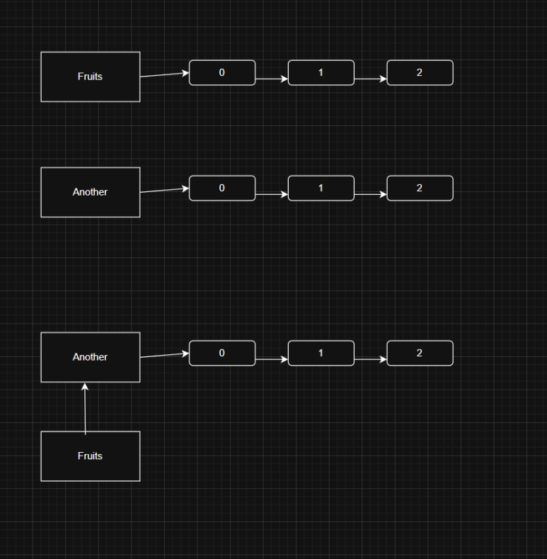

# Array
This diagram might show it better. Top is 
`fruits == another`, where both have different references.
Bottom is
```js
const fruits = [0,1,2];
const another = fruits;
fruits == another ; // true!
```
where both pointers are the same.




The top `fruits == another` will never be equal, because the references are different, and to compare them you need to go through each array and check the values.
Bottom one, where both point to the same thing, the references will be equal